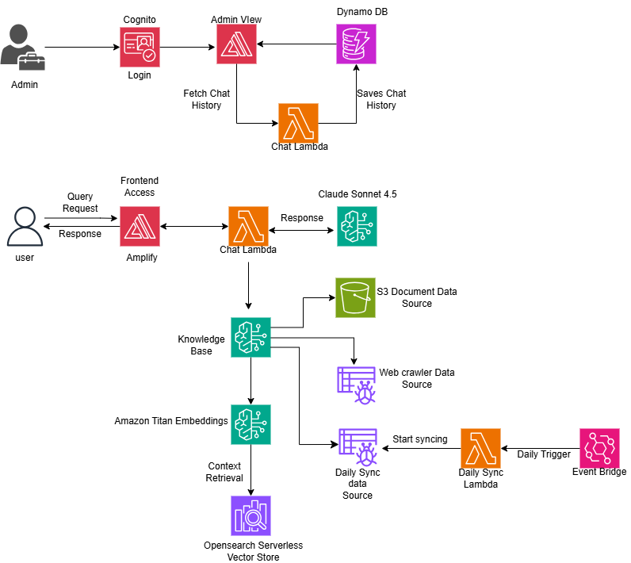

Blood Bank AI Chatbot

An intelligent AI-powered chatbot that helps users learn about blood donation, find donation centers, and get real-time information about blood supply status. Built with AWS Bedrock Knowledge Base and a modern React frontend.

## Demo Video

<video controls src="docs/media/Blood Bank Project - AI Assistant - Brave 2026-06-18 21-55-28.mp4" title="Title"></video>


## Disclaimers
Customers are responsible for making their own independent assessment of the information in this document.

This document:

(a) is for informational purposes only,

(b) references AWS product offerings and practices, which are subject to change without notice,

(c) does not create any commitments or assurances from AWS and its affiliates, suppliers or licensors. AWS products or services are provided "as is" without warranties, representations, or conditions of any kind, whether express or implied. The responsibilities and liabilities of AWS to its customers are controlled by AWS agreements, and this document is not part of, nor does it modify, any agreement between AWS and its customers, and

(d) is not to be considered a recommendation or viewpoint of AWS.

Additionally, you are solely responsible for testing, security and optimizing all code and assets on GitHub repo, and all such code and assets should be considered:

(a) as-is and without warranties or representations of any kind,

(b) not suitable for production environments, or on production or other critical data, and

(c) to include shortcuts in order to support rapid prototyping such as, but not limited to, relaxed authentication and authorization and a lack of strict adherence to security best practices.

All work produced is open source. More information can be found in the GitHub repo.

## Index

| Description           | Link                                                   |
| --------------------- | ------------------------------------------------------ |
| Overview              | [Overview](#overview)                                  |
| Architecture          | [Architecture](#architecture-diagram)                  |
| Detailed Architecture | [Architecture Deep Dive](docs/architectureDeepDive.md) |
| Deployment            | [Deployment Guide](docs/deploymentGuide.md)            |
| User Guide            | [User Guide](docs/userGuide.md)                        |
| API Documentation     | [API Documentation](docs/APIDoc.md)                    |
| Modification Guide    | [Modification Guide](docs/modificationGuide.md)        |
| Credits               | [Credits](#credits)                                    |
| License               | [License](#license)                                    |

## Overview

Blood Bank AI Chatbot is a conversational AI assistant designed to provide comprehensive information about blood donation. It enables users to get instant, accurate answers about eligibility, donation process, blood center locations, and current blood supply status through natural language conversations.

### Key Features

- **AI-Powered Conversations** using AWS Bedrock Models
- **Knowledge Base Integration** with blood donation documents and website content
- **Bilingual Support** for English and Spanish users
- **Real-time Information** with daily content updates
- **Source Citations** with links to authoritative information
- **Admin Dashboard** for monitoring conversations and managing data sources
- **Blood Center Locator** integration for finding nearby donation locations
- **Responsive Design** optimized for both desktop and mobile devices

## Architecture Diagram



The application implements a serverless architecture on AWS, combining:

- **Frontend**: React application hosted on AWS Amplify with built-in CDN
- **Backend**: AWS CDK-deployed infrastructure with Lambda Function URL (no API Gateway)
- **AI Layer**: AWS Bedrock Knowledge Base with 3 data sources (documents, website, daily-sync)
- **Data Storage**: S3 for documents, DynamoDB for conversation history, OpenSearch Serverless for vector embeddings
- **Authentication**: Amazon Cognito for admin dashboard access
- **Orchestration**: Step Functions for sequential data source synchronization
- **Automation**: EventBridge for daily sync scheduling (2 PM EST / 7 PM UTC)

For a detailed deep dive into the architecture, see [docs/architectureDeepDive.md](docs/architectureDeepDive.md).

## Deployment

For detailed deployment instructions, including prerequisites and step-by-step guides, see [docs/deploymentGuide.md](docs/deploymentGuide.md).

### Quick Start

```bash
# Clone the repository
git clone https://github.com/your-org/America-Blood-Centers-chatbot.git
cd America-Blood-Centers-chatbot/Backend

# Run the deployment script
chmod +x deploy.sh
./deploy.sh
```

## User Guide

For detailed usage instructions with screenshots, see [docs/userGuide.md](docs/userGuide.md).

## API Documentation

For complete API reference including chat endpoints, admin APIs, and authentication, see [docs/APIDoc.md](docs/APIDoc.md).

## Modification Guide

For developers looking to extend or customize this project, see [docs/modificationGuide.md](docs/modificationGuide.md).

## Directory Structure

```
├── Backend/
│   ├── bin/
│   │   └── bedrock-stack.ts        # CDK app entry point
│   ├── lambda/
│   │   ├── chat-lambda/            # Main chat handler with streaming
│   │   └── sync-operations/        # Data source management
│   ├── lib/
│   │   └── bedrock-chatbot-stack.ts # Main CDK stack definition
│   ├── data-sources/               # Knowledge base content
│   ├── deploy.sh                   # One-command deployment script
│   ├── cdk.json
│   ├── package.json
│   └── tsconfig.json
├── Frontend/
│   ├── src/
│   │   ├── admin/                  # Admin login and dashboard
│   │   ├── Components/             # Reusable UI components
│   │   ├── services/               # API and authentication services
│   │   ├── utilities/              # Constants and helper functions
│   │   ├── App.js                  # Main application component
│   │   └── index.js                # Application entry point
│   ├── public/
│   │   ├── logo.png               # Blood Bank logo
│   │   └── index.html
│   └── package.json
├── docs/
│   ├── architectureDeepDive.md
│   ├── deploymentGuide.md
│   ├── userGuide.md
│   ├── APIDoc.md
│   ├── modificationGuide.md
│   ├── media/                      # Screenshots and diagrams
│   └── Architecture_Diagram.png # Architecture diagram
├── LICENSE
└── README.md
```

## Features

### Core Functionality
- **Intelligent Q&A**: Natural language processing for blood donation questions
- **Bilingual Support**: Full English and Spanish language support
- **Source Attribution**: Every response includes citations to authoritative sources
- **Real-time Updates**: Daily synchronization of blood supply and center information

### Data Sources
- **PDF Documents**: Official guidelines, statistics, and educational materials
- **Website Content**: Live content from americasblood.org including donation centers
- **Daily Sync**: Automated updates of time-sensitive information

### Admin Features
- **Conversation Monitoring**: View and analyze chat interactions
- **Data Source Management**: Manual sync triggers and status monitoring
- **System Health**: Real-time status of all system components
- **Analytics Dashboard**: Usage statistics and popular questions

### Technical Features
- **Serverless Architecture**: Auto-scaling AWS Lambda functions
- **Vector Search**: Semantic search using Amazon Bedrock Knowledge Base
- **Advanced PDF Processing**: Bedrock Data Automation with multimodal support
- **Secure Authentication**: Amazon Cognito for admin access

## Data Flow

1. **User Interaction**: User sends question through React frontend hosted on Amplify
2. **Lambda Function URL**: Frontend calls Lambda directly (no API Gateway)
3. **Knowledge Base Query**: Lambda queries Bedrock Knowledge Base using retrieve_and_generate API
4. **Vector Search**: OpenSearch Serverless performs semantic search on embeddings (1536 dimensions)
5. **AI Response**: Bedrock generates streaming response using Claude Sonnet with retrieved context
6. **Source Attribution**: System adds citations and streams formatted response via SSE

## Security & Compliance

- **Data Privacy**: No personal information stored in conversation logs
- **Secure Authentication**: JWT-based admin authentication via Cognito
- **Encrypted Communication**: All data encrypted in transit and at rest
- **Access Control**: Fine-grained IAM permissions for all AWS resources

## Credits

This application was developed for Blood Bank to support their mission of ensuring a safe and adequate blood supply for patients in need.

**Built with:**
- AWS Bedrock for AI/ML capabilities
- React and Material-UI for the frontend
- AWS CDK for infrastructure as code
- OpenSearch Serverless for vector search

## License

This project is licensed under the MIT License - see the [LICENSE](./LICENSE) file for details.
